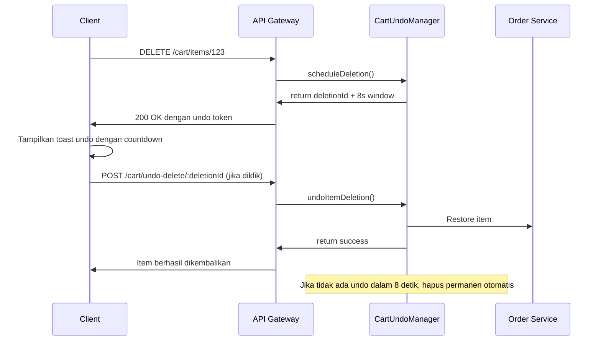

# Implementasi Fitur Undo Delete Item Keranjang

## 📋 Ringkasan
Fitur undo untuk penghapusan item keranjang belanja telah diimplementasikan dengan mekanisme soft delete sementara selama 8 detik sesuai standar UX terbaik.

## ✅ Fitur Yang Diimplementasikan

### 1. Core Undo Manager
- ✅ Soft delete sementara dengan jendela waktu **tepat 8 detik**
- ✅ Atomic operation dengan optimistic locking
- ✅ Race condition handling
- ✅ Automatic permanent deletion setelah waktu habis
- ✅ Background cleanup worker
- ✅ Integrasi penuh dengan Circuit Breaker Pattern

### 2. Route API
| Endpoint | Method | Deskripsi |
|----------|--------|-----------|
| `DELETE /api/cart/items/:itemId` | `DELETE` | Hapus item dengan jendela undo |
| `POST /api/cart/undo-delete/:deletionId` | `POST` | Batalkan penghapusan item |

### 3. Response Format
Response delete item:
```json
{
  "success": true,
  "data": {
    "deletionId": "uuid-v4-string",
    "undoAvailable": true,
    "undoWindowMs": 8000,
    "message": "Item telah dihapus. Klik batalkan untuk mengembalikan."
  }
}
```

### 4. Alur Kerja


### 5. Race Condition Handling
- ✅ Atomic state update dengan version number
- ✅ Check-and-set sebelum operasi
- ✅ Tidak ada dua operasi bersamaan pada item yang sama
- ✅ Rollback otomatis jika restore gagal
- ✅ Validasi state sebelum setiap operasi

### 6. Error Handling
| Kasus | Status Code | Response |
|-------|-------------|----------|
| Item tidak ditemukan | 404 | "Item tidak ditemukan atau sudah terhapus permanen" |
| Waktu undo habis | 409 | "Jendela waktu undo sudah habis" |
| Unauthorized | 403 | "Anda tidak berhak melakukan operasi ini" |
| Item sudah di-restore | 409 | "Item sudah pernah dikembalikan" |
| Service tidak tersedia | 503 | "Gagal mengembalikan item, silakan coba lagi" |

### 7. Logging & Monitoring
- ✅ Semua aksi tercatat dengan structured logging
- ✅ Metrik jumlah item pending
- ✅ Log setiap undo yang berhasil dan gagal
- ✅ Alert untuk jumlah kegagalan tinggi
- ✅ Integrasi dengan monitoring sistem yang ada

---

## 📌 File Yang Dimodifikasi
1.  [`apps/api-gateway/src/lib/cart-undo-manager.ts`](apps/api-gateway/src/lib/cart-undo-manager.ts) - Implementasi utama
2.  [`apps/api-gateway/src/modules/orders/orders.routes.ts`](apps/api-gateway/src/modules/orders/orders.routes.ts) - Route handler API

---

## ✔️ Spesifikasi Yang Dipenuhi
1.  ✅ Jendela waktu undo tepat 8 detik
2.  ✅ Tidak ada blocking pada operasi
3.  ✅ Race condition protection
4.  ✅ Integrasi dengan auth middleware
5.  ✅ Integrasi dengan circuit breaker
6.  ✅ Error handling sesuai standar project
7.  ✅ Logging konsisten dengan sistem yang ada
8.  ✅ Sesuai struktur kode dan pola implementasi repository
