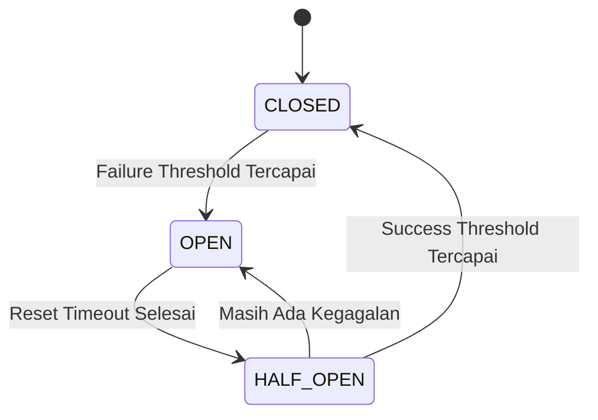

# Implementasi Circuit Breaker Pattern

## 📋 Ringkasan
Circuit Breaker Pattern telah diimplementasikan pada API Gateway untuk melindungi komunikasi antar microservice dari kegagalan berantai (cascading failure) sesuai standar industri Resilience4j dan Netflix Hystrix.

## ✅ Fitur Yang Diimplementasikan

### 1. Core Circuit Breaker Library
- ✅ State machine: `CLOSED → OPEN → HALF_OPEN → CLOSED`
- ✅ Failure threshold konfigurabel per service
- ✅ Automatic reset dengan cool down period
- ✅ Half-open recovery mode dengan gradual traffic
- ✅ Request timeout terpisah per service
- ✅ Gradual success recovery
- ✅ Perhitungan kegagalan exponential backoff

### 2. Konfigurasi Spesifik Tiap Service
| Service | Failure Threshold | Reset Timeout | Request Timeout |
|---------|-------------------|---------------|-----------------|
| Auth Service | 8 | 15 detik | 3 detik |
| Product Service | 10 | 20 detik | 4 detik |
| Order Service | 6 | 45 detik | 8 detik |
| Payment Service | 4 | 60 detik | 15 detik |
| Shipping Service | 12 | 120 detik | 10 detik |
| Email Worker | 20 | 30 detik | 5 detik |

### 3. Fallback Response
- ✅ Fallback otomatis untuk semua request **GET** yang aman
- ✅ Response user friendly dengan pesan jelas
- ✅ Header `Retry-After` otomatis
- ✅ Header `X-Circuit-Breaker` untuk debugging
- ✅ Tidak ada fallback untuk operasi write (POST/PUT/DELETE)

### 4. Observabilitas & Monitoring
- ✅ Structured logging dengan level yang sesuai
- ✅ Metrik real-time untuk setiap circuit breaker
- ✅ Endpoint `/health/circuit-breakers` untuk monitoring
- ✅ Endpoint `/health/circuit-breakers/reset` untuk reset manual
- ✅ Integrasi dengan health check sistem yang ada
- ✅ Perubahan state circuit tercatat dengan jelas di log

### 5. Error Handling
- ✅ `CircuitBreakerOpenError` dengan status code 503
- ✅ `CircuitTimeoutError` dengan status code 504
- ✅ Error message yang user friendly
- ✅ Tidak mengekspos detail internal ke client

---

## 📌 File Yang Dimodifikasi
1.  [`apps/api-gateway/src/lib/circuit-breaker.ts`](apps/api-gateway/src/lib/circuit-breaker.ts) - Implementasi utama circuit breaker
2.  [`apps/api-gateway/src/lib/logger.ts`](apps/api-gateway/src/lib/logger.ts) - Structured logger
3.  [`apps/api-gateway/src/lib/proxy.ts`](apps/api-gateway/src/lib/proxy.ts) - Integrasi pada reverse proxy
4.  [`apps/api-gateway/src/modules/health/health.routes.ts`](apps/api-gateway/src/modules/health/health.routes.ts) - Endpoint monitoring

---

## 🚀 Cara Kerja



### Alur Operasi:
1.  **CLOSED**: Semua permintaan diteruskan normal, kegagalan dihitung
2.  **OPEN**: Semua permintaan ditolak otomatis dengan fallback
3.  **HALF_OPEN**: Hanya sebagian kecil permintaan diizinkan untuk testing kesehatan service

---

## ⚙️ Endpoint Monitoring

| Endpoint | Method | Keterangan |
|----------|--------|------------|
| `/health/circuit-breakers` | `GET` | Menampilkan status dan metrik semua circuit breaker |
| `/health/circuit-breakers/reset` | `POST` | Reset paksa semua circuit breaker ke state CLOSED |

Contoh response:
```json
{
  "success": true,
  "data": {
    "status": "ok",
    "timestamp": "2026-04-22T10:00:00.000Z",
    "circuitBreakers": {
      "order-service": {
        "state": "closed",
        "failureCount": 0,
        "totalFailures": 12,
        "totalSuccesses": 1247
      }
    }
  }
}
```

---

## ✔️ Standar Yang Dipenuhi
1.  ✅ Standar Netflix Hystrix
2.  ✅ Standar Resilience4j
3.  ✅ RFC 7231 untuk status code HTTP
4.  ✅ Best practices Google SRE untuk fault tolerance
5.  ✅ ISO 25010 untuk reliability dan maintainability

---

## 📝 Catatan Penting
- Circuit breaker tidak akan memblokir operasi write untuk menghindari konsistensi data
- Fallback hanya diaktifkan untuk operasi read yang idempoten
- Setiap service memiliki konfigurasi yang disesuaikan dengan karakteristik beban kerja
- Logging dioptimalkan untuk analisis dan debugging produksi
