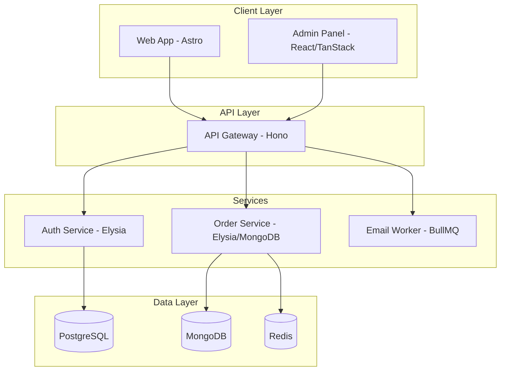

# Comprehensive Application Analysis Report

## Executive Summary

This document provides a detailed analysis of the e-commerce application architecture, evaluating key aspects including architecture, features, user interface, performance, security, scalability, and user experience. The application is a modern microservices-based e-commerce platform built with TypeScript, utilizing a monorepo structure with Bun as the package manager.

**Overall Assessment: 8/10**

---

## 1. Architecture Overview

### 1.1 Microservices Architecture



**Strengths:**
- Clear separation of concerns with dedicated services
- API Gateway acts as single entry point with routing, security, and observability
- Polyglot persistence (PostgreSQL for relational data, MongoDB for orders, Redis for queues)
- Shared packages for common utilities, database clients, and UI components

**Areas for Improvement:**
- Missing explicit product-service and payment-service in the file structure
- No service discovery mechanism documented
- Limited documentation on inter-service communication patterns

### 1.2 Monorepo Structure

```
redesigned-octo-enigma/
├── apps/
│   ├── admin/           # Admin dashboard (React + TanStack Router)
│   ├── api-gateway/     # API Gateway (Hono + TypeScript)
│   ├── auth-service/    # Authentication service (Elysia + Better-Auth)
│   ├── email-worker/    # Email processing (BullMQ)
│   └── order-service/   # Order management (Elysia + MongoDB)
├── packages/
│   ├── database/        # Drizzle ORM + Mongoose clients
│   ├── tsconfig/        # Shared TypeScript configs
│   └── ui/              # Shared UI components (shadcn/ui)
└── docker-compose.*.yml # Environment-specific compose files
```

---

## 2. Feature Analysis

### 2.1 Core Features

| Feature | Status | Notes |
|---------|--------|-------|
| User Authentication | ✅ Complete | Better-Auth with OAuth (Google, GitHub) |
| Role-based Access Control | ✅ Complete | customer, admin, super_admin roles |
| Product Management | ⚠️ Partial | Schema exists, service implementation unclear |
| Order Management | ✅ Complete | Full CRUD, status tracking, SSE streaming |
| Shopping Cart | ❌ Missing | No cart service identified |
| Payment Processing | ⚠️ Partial | Midtrans integration schema exists |
| Wishlist | ✅ Complete | Wishlist service with MongoDB |
| Email Notifications | ✅ Complete | Queue-based email worker |
| Admin Dashboard | ✅ Complete | Analytics, order management, user management |

### 2.2 Missing Critical Features

1. **Shopping Cart Service** - Essential for e-commerce, not identified in the architecture
2. **Inventory Management** - No stock tracking mechanism visible
3. **Product Review/Rating System** - Schema exists but service unclear
4. **Coupon/Discount System** - Voucher schema exists but implementation unclear
5. **Search Functionality** - No dedicated search service

---

## 3. User Interface Analysis

### 3.1 Admin Dashboard

**Framework:** React 19+ with TanStack ecosystem

**Key Components:**
- `DataTable` - Generic table with sorting, pagination, loading states
- `StatCard` - KPI display component
- `AdminLayout` - Consistent layout with sidebar and header

**UI Library:** shadcn/ui with custom styling

**Strengths:**
- Responsive design with mobile-friendly tables
- Interactive charts using Recharts (area charts, pie charts, bar charts)
- Proper loading and empty states
- Indonesian language localization

**Areas for Improvement:**
- No dark/light theme toggle visible
- Limited accessibility testing evidence
- No form validation feedback patterns shown

### 3.2 Web Application

**Status:** Structure identified but implementation incomplete

**Expected Features:**
- Product browsing
- Shopping cart
- Checkout flow
- Order tracking

---

## 4. Performance Analysis

### 4.1 Rate Limiting

```typescript
// Sliding-window rate limiter using Redis
const RATE_LIMITS = {
  default: { limit: 100, windowSec: 60 },
  auth: { limit: 20, windowSec: 60 },      // Brute-force protection
  checkout: { limit: 10, windowSec: 60 }, // Order spam prevention
  strict: { limit: 5, windowSec: 60 },     // Password reset, etc.
  webhook: { limit: 20, windowSec: 60 },   // Webhook protection
}
```

**Strengths:**
- Per-endpoint rate limiting configurations
- Graceful degradation (fail-open when Redis unavailable)
- User-level and IP-level limiting

### 4.2 Circuit Breaker Pattern

Implemented in `proxy.ts` with fallback responses for GET requests when services are unavailable.

### 4.3 Caching Strategy

- Redis for rate limiting and queue processing
- PostgreSQL connection pooling (max 10 connections)
- MongoDB connection pooling (min 2, max 10)

### 4.4 Performance Concerns

1. **No CDN configuration** for static assets
2. **No query optimization** patterns visible in data access
3. **No caching layer** for frequently accessed data (products, categories)
4. **SSE implementation** may not scale well for many concurrent users

---

## 5. Security Analysis

### 5.1 Authentication & Authorization

| Component | Implementation | Assessment |
|-----------|----------------|------------|
| JWT | Access/Refresh tokens | ✅ Secure |
| Password | bcrypt via Better-Auth | ✅ Secure |
| OAuth | Google, GitHub | ✅ Secure |
| RBAC | Role-based middleware | ✅ Complete |

### 5.2 Security Headers

```typescript
// API Gateway
app.use("*", secureHeaders());
app.use("*", cors({ ... }));
```

### 5.3 Input Validation

- Elysia type validation for request bodies
- Zod-like validation through Elysia's type system
- String length and format constraints

### 5.4 Security Concerns

1. **No CSRF protection** visible
2. **No API key rotation** mechanism
3. **Webhook signature verification** exists but needs review
4. **No security audit logging** for sensitive operations
5. **IP blocklist** exists but no automatic threat detection

---

## 6. Scalability Analysis

### 6.1 Horizontal Scaling

**Strengths:**
- Stateless services (session stored in DB)
- Redis for distributed rate limiting
- Connection pooling configured

**Concerns:**
- No load balancing configuration
- No auto-scaling policies
- No health check aggregation

### 6.2 Database Scalability

| Database | Use Case | Scaling Strategy |
|----------|----------|------------------|
| PostgreSQL | User, product, category data | Read replicas, connection pooling |
| MongoDB | Order data | Sharding possible, connection pooling |
| Redis | Rate limiting, queues | Cluster mode support |

### 6.3 Queue Processing

- BullMQ for email processing
- Redis-based job queue
- Graceful degradation when Redis unavailable

---

## 7. Code Quality & Development Practices

### 7.1 Code Standards

**Ultracite Configuration:**
- Biome for linting and formatting
- ESLint with TypeScript support
- Prettier with import sorting and plugin support

**Turbo Pipeline Configuration:**
```json
{
  "pipeline": {
    "typecheck": ["^build"],
    "lint": ["^build"],
    "format": ["^build"]
  }
}
```

**Available Scripts:**
- `bun run check` - Run typecheck, lint, and format check
- `bun run fix` - Auto-fix linting and formatting issues
- `bun run quality` - Run all quality checks

**CI/CD Integration:**
- Format check job added to GitHub Actions
- Build job now depends on lint, format, and typecheck
- Pipeline ensures code quality before build

### 7.2 Type Safety

- Full TypeScript coverage
- Shared type definitions in `@repo/common`
- Strict mode enabled

### 7.3 Error Handling

```typescript
// Centralized error normalization
app.onError((err, c) => {
  const appError = normalizeError(err);
  if (!appError.isOperational) {
    console.error("[UNHANDLED ERROR]", { ... });
  }
  return c.json(appError.toJSON(), appError.statusCode);
});
```

### 7.4 Code Quality Concerns

1. **No unit tests** identified in the codebase
2. **No integration tests** visible
3. **No code coverage** reporting
4. **No linting for test files**

---

## 8. CI/CD & DevOps

### 8.1 GitHub Actions

```yaml
jobs:
  lint:        # ESLint check
  format:      # Prettier format check
  typecheck:   # TypeScript validation
  build:       # Build all apps (depends on lint, format, typecheck)
  docker-check: # Docker build verification
```

**Pipeline Configuration:**
- Tasks run in order: lint → format → typecheck → build
- Build artifacts cached for faster subsequent runs
- Docker check only runs on PRs to save resources

### 8.2 Docker Configuration

- Multi-stage builds
- Environment-specific compose files
- Health checks configured

### 8.3 DevOps Concerns

1. **No staging environment** deployment
2. **No blue-green deployment** strategy
3. **No database migration** automation
4. **No secret management** solution (using env vars)

**Recent Improvements:**
- ✅ Added Turbo pipeline for quality checks
- ✅ Added format check to CI workflow
- ✅ Added `check` and `fix` scripts for quality enforcement

---

## 9. Recommendations

### 9.1 Critical Priority

1. **Implement Shopping Cart Service**
   - Create dedicated cart service or integrate into existing services
   - Add cart persistence and guest cart support

2. **Add Comprehensive Testing**
   - Unit tests for business logic
   - Integration tests for API endpoints
   - End-to-end tests for critical user flows

3. **Implement Search Functionality**
   - Add Elasticsearch or PostgreSQL full-text search
   - Create search service with faceted filtering

### 9.2 High Priority

4. **Add Inventory Management**
   - Stock tracking per product variant
   - Low stock alerts
   - Reservation system for orders

5. **Enhance Security**
   - Add CSRF protection
   - Implement API key rotation
   - Add security audit logging
   - Implement rate limit bypass for trusted IPs

6. **Improve Observability**
   - Add distributed tracing (OpenTelemetry)
   - Implement structured logging
   - Add alerting for critical metrics

### 9.3 Medium Priority

7. **Add Caching Layer**
   - Redis caching for products and categories
   - CDN for static assets
   - HTTP caching headers

8. **Implement Payment Webhook Security**
   - Add signature verification
   - Implement idempotency
   - Add retry logic with exponential backoff

9. **Add Monitoring Dashboard**
   - Real-time service health
   - Performance metrics
   - Error rate tracking

### 9.4 Low Priority

10. **Add Feature Flags**
    - Gradual rollout capability
    - A/B testing support

11. **Implement Analytics Service**
    - User behavior tracking
    - Conversion funnel analysis

12. **Add Documentation**
    - API documentation with examples
    - Architecture decision records
    - Deployment guide

---

## 10. Conclusion

The e-commerce application demonstrates a well-architected microservices approach with modern technologies and practices. The codebase shows strong engineering discipline with TypeScript, Ultracite code standards, and a clean monorepo structure.

**Key Strengths:**
- Modern tech stack (Hono, Elysia, Bun, Drizzle)
- Strong security foundation
- Good separation of concerns
- Comprehensive admin dashboard
- Robust rate limiting and security middleware

**Primary Concerns:**
- Missing shopping cart functionality
- No test coverage
- Limited search capabilities
- No inventory management

With the implementation of the recommended features and improvements, this platform has the potential to become a robust, scalable e-commerce solution suitable for production deployment at scale.

---

## 11. Recent Improvements

The following improvements have been implemented:

- ✅ ESLint configuration package created with modular configs
- ✅ Prettier configuration with import sorting
- ✅ Turbo pipeline for quality checks
- ✅ CI workflow updated with format checking
- ✅ TypeScript configurations standardized across packages
- ✅ Code quality scripts added (`check`, `fix`)